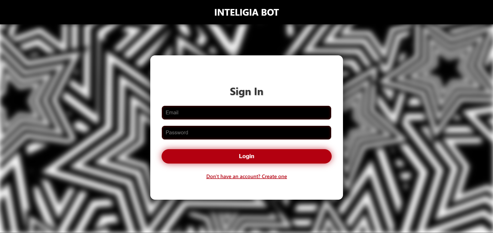

# Inteligia Bot — AI Chat Web Application   

A sleek, modern AI-powered chat application with user authentication, chat history, and real-time interaction using React, Express, MongoDB, and OpenAI's API.

[Live Demo](https://www.youtube.com/watch?v=3lEn34VKO9I)

---

## Features

- **User Authentication:** Register and login with JWT-based authentication.
- **Persistent Chat History:** Saved chat logs retrieved on login.
- **AI Chatbot:** Powered by OpenAI’s language model, responds intelligently.
- **Clean UI:** Responsive and visually appealing chat interface with a blurred background.
- **Logout Support:** Easily sign out and clear your session.

---

## Screenshots

### Landing Page  

### Login & Register  

### Chat Interface  

---

## Tech Stack

- **Frontend:** React.js, Axios  
- **Backend:** Node.js, Express.js  
- **Database:** MongoDB (Mongoose)  
- **Authentication:** JSON Web Tokens (JWT)  
- **AI Integration:** OpenAI API

---

## Getting Started

### Prerequisites

- Node.js (v16+ recommended)
- MongoDB (local or Atlas)
- OpenAI API Key

### Installation

1. Clone the repo

    git clone https://github.com/Ansh5525/Inteligia-Bot
    cd inteligia-bot

2. Setup backend

    cd backend
    npm install

- Create a `.env` file in `backend/`:

       MONGO_URI=your_mongo_connection_string
       JWT_SECRET=your_jwt_secret_key
       OPENAI_API_KEY=your_openai_api_key

3. Setup frontend

    cd ../frontend
    npm install
    npm start

4. Start backend server

    cd ../backend
    npm run dev

---

## Usage

- Register a new account or login with your credentials.
- Chat with the AI bot in real-time.
- Your conversation history will be saved and loaded upon login.
- Click **Logout** to end your session securely.

---

## Project Structure

    /backend        # Express API, auth, chat routes, DB models
    /frontend       # React app with Chat and Auth components
    /public/images  # Background images and assets

---

## API Endpoints

- `POST /api/auth/register` — Register a new user  
- `POST /api/auth/login` — Login and get JWT token  
- `GET /api/chatlogs` — Get chat history for authenticated user  
- `POST /api/chat` — Send message and receive AI response  

---

## Contact

Created by **Ansh Partap Singh** – [apsingh6235@gmail.com](mailto:apsingh6235@gmail.com)  
